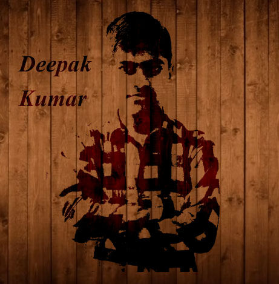

<link rel="stylesheet" href="https://cdnjs.cloudflare.com/ajax/libs/font-awesome/6.0.0-beta3/css/all.min.css" integrity="sha512-Fo3rlrZj/k7ujTnHg4CGR2D7kSs0v4LLanw2qksYuRlEzO+tcaEPQogQ0KaoGN26/zrn20ImR1DfuLWnOo7aBA==" crossorigin="anonymous" referrerpolicy="no-referrer" />

<h1 align="center"> Hi! 👋,  I'm Deepak Kumar </h1>

<center></center>

---

### Favourite Lines
```
    while(alive){
        Keep Learning;
    }
```


<br/>

> ### Wanna Connect me
> [](https://www.linkedin.com/in/deepak-kumar-947a16202/ "LinkedIn Proflie") [](mailto:dk10112002@gmail.com "Gmail") [](https://twitter.com/DeepakK04972519 "Twitter") [](https://www.instagram.com/_10_deepak/  "Instagram")

<br/>

---

<br/>

> ## Skills
> 


<br/>

---

<br/>

<center>

</center>
